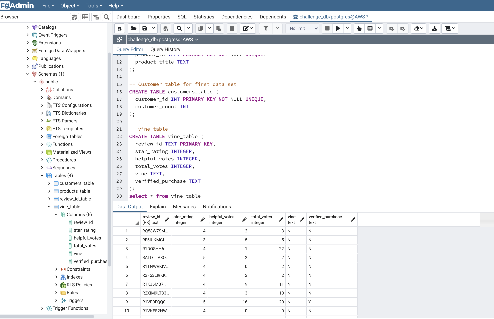
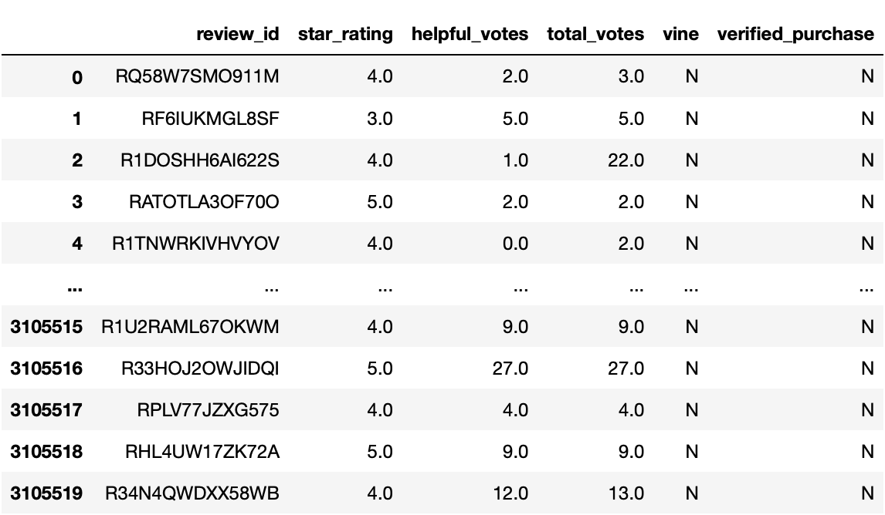
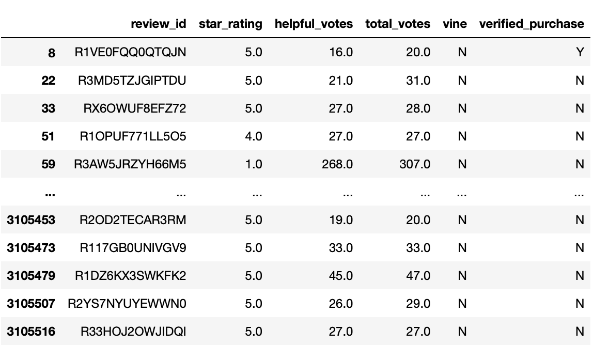
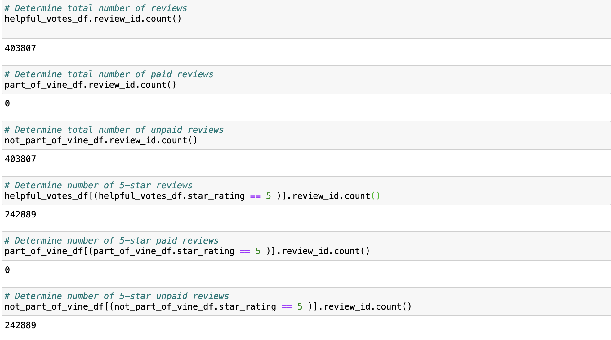
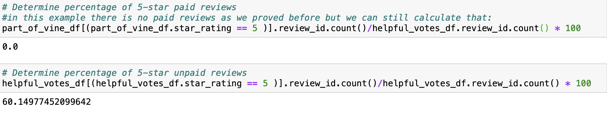

# Amazon_Vine_Analysis

## Resources
* Python 3.9.0, 
* Anaconda Navigator 1.9.12,
* Jupyter notebook 6.0.3,
* Google Colab notebooks,
* Amazon Web Services -AWS-
* PgAdmin 4
* Pandas, Pyspark, postgres, AWS-RDS, AWS-S3

## Overview

This project analyzes Amazon reviews and measures how many reviews are written by members of the paid Amazon Vine program. In order to complete this analysis, we used a random subset of data that retained Amazon books reviews details. then performed an ETL on this data by using PySpark, AWS, Google Collaboratory, PostgreSQL, and Pandas. In this specific example there were no paid reviews on this dataset, and the process to be sure about that was as follows:

## Analysis

After grabbing the data from the S3 amazon bucket, we then created an RDS instance that we connected to Postgres and loaded the data into using Pyspark.
 our database instance looks like:
 
 

After the ETL process, we used pandas to make perform our analysis, we wanted to count how many reviews we had and how many of those reviews were paid for by the Vine program and the percentage of 5* reviews for each category.

- First, we load our Data into Pandas:

- after a little data cleaning to keep only the useful reviews, we then try to split the data to either vine reviews or non-vine reviews:

when we look for the paid reviews, Pandas returns an empty Dataset:

 
the reviews that aren’t part of the vine program:

## Results

We use pandas to perform additional analysis on this subset:

- We can see that this Dataset is made of 403807 reviews.
- the number of 5 star votes is : 242889.
- there is no Vine program reviews in this dataset.

Last we calculate the percentage of 5 star reviews in the data.

we can see that the 5* reviews make up 60.15% of this dataset, and that 0% of them are paid for.

## Summary

- For this specific example there was no Positive bias, because the data is made entirely of organic reviews.

- for additional analysis, we could look at the verified_purchase and perform a similar analysis to what we did here to see what confirmed buyers think of the books compared to other reviewers.

